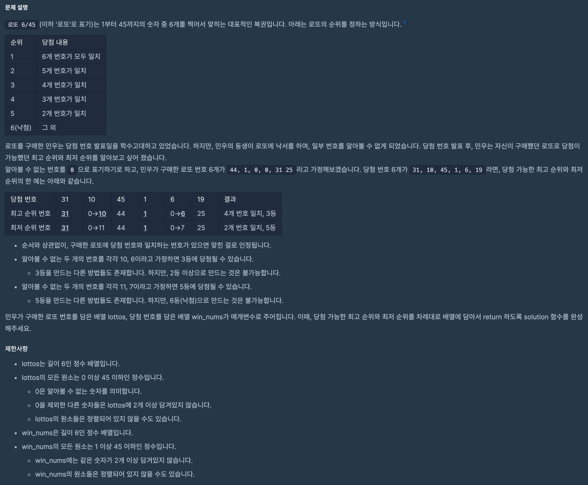

# 문제

프로그래머스 Lv.1



# 나의 풀이

```javascript
function solution(lottos, win_nums) {
  var answer = [];
  const rank = [6, 6, 5, 4, 3, 2, 1];

  const same = lottos.filter((num) => win_nums.includes(num)).length;
  const zeros = lottos.filter(num === 0).length;

  const min = rank[same];
  const max = rank[min + zeros];

  answer = [max, min];
  return answer;
}
```

## 가져갈 것

- `rank` array를 생각해내는 것
- 일치하는 수의 개수: 적어도 일치할 숫자 -> 최소 등수
- 0의 개수: 일치할 숫자에 0의 개수만큼 더해짐 -> 최대 등수
