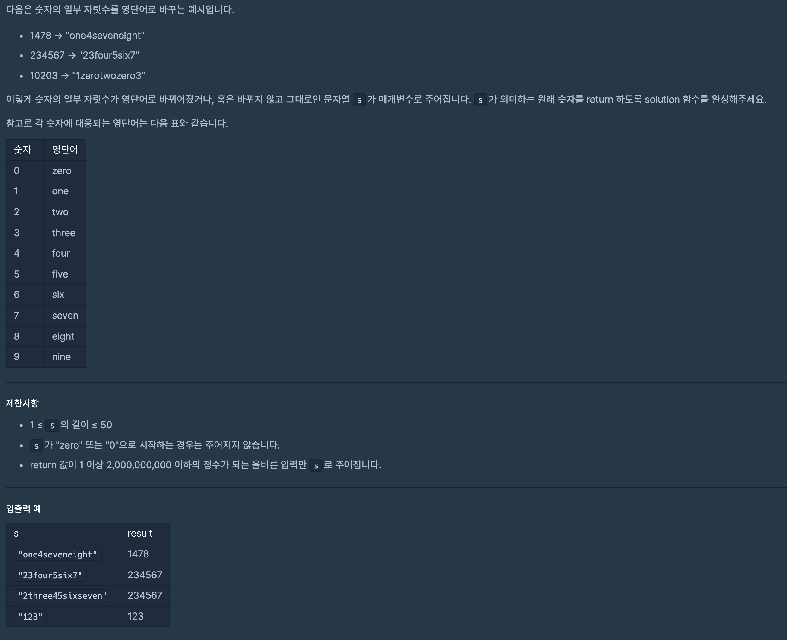

# 문제



# 나의 풀이

```javascript
function solution(s) {
  const numbers = [
    'zero',
    'one',
    'two',
    'three',
    'four',
    'five',
    'six',
    'seven',
    'eight',
    'nine',
  ];

  numbers.map((el, i) => {
    s = s.replace(el, i).replace(el, i);
  });

  var answer = 0;
  answer = s;
  return parseInt(answer);
}
```

- replaceAll이란 방법도 있지만 현재 프로그래머스에서는 해당 method는 지원하지 않는 듯
- replace를 한번만`.replace(el, i)` 이렇게 해주면 100% 답이 나오지 않음 (같은 string이 한 `s`안에 2개 이상 있는 듯)
- 그래서 `.replace(el, i)`를 한번 더 해줘 문제 해결

# 다른 풀이

```javascript
function solution(s) {
  let numbers = [
    'zero',
    'one',
    'two',
    'three',
    'four',
    'five',
    'six',
    'seven',
    'eight',
    'nine',
  ];
  var answer = s;

  for (let i = 0; i < numbers.length; i++) {
    let arr = answer.split(numbers[i]);
    answer = arr.join(i);
  }

  return Number(answer);
}
```

- `split()`과 `join()`의 적절한 사용
