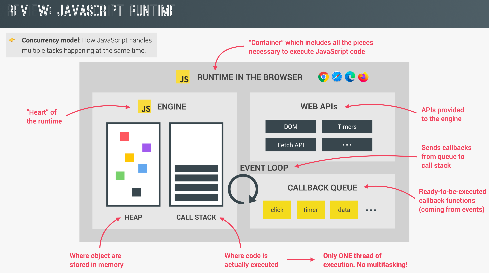

# JavaScript의 작동 과정

## 요약

- JS BTS-1
  

- JS BTS-2
  

## 구성요소

1. Call Stack
2. Memory Heap
3. Event Loop
4. Callback Queue
5. Web APIs

## Call Stack

- 실행될 코드가 한 줄 단위로 할당되는 곳

## Memory Heap

- 메모리 할당이 일어나는 곳
- heap: 구조화되지 않은 넓은 메모리 영역

## Event Loop

- Callback Queue에 할당된 함수를 순서에 맞춰 콜 스택에 할당해 줌
- 콜백 큐 내 우선순위에 따라 콜 스택에 할당함
  - Microtask Queue(Job Queue) - Promise
  - Animation Frames - requestAnimationFrame
  - Task Queue(Event Queue) - setTimeout

## Callback Queue

- 비동기 처리 끝난 후 실행되어야 할 콜백 함수가 차례로 할당되는 곳

## Web APIs

- 비동기 처리될 코드 담당
